# Diagramme de cas d'utilisation — NEGOSUD

```mermaid
graph TD
    Admin(["👤 Administrateur"])
    Employe(["👤 Employé"])
    Client(["👤 Client Boutique"])

    subgraph BackOffice["🔒 Back-office (authentifié)"]
        UC1["Gérer les articles"]
        UC2["Gérer les familles"]
        UC3["Gérer les fournisseurs"]
        UC4["Gérer les clients"]
        UC5["Gérer les commandes clients"]
        UC6["Gérer les commandes fournisseurs"]
        UC7["Gérer les inventaires"]
        UC8["Valider / Livrer une commande"]
        UC9["Gérer les utilisateurs"]
    end

    subgraph Boutique["🌐 Boutique (public)"]
        UC10["Consulter le catalogue"]
        UC11["Filtrer et trier les articles"]
        UC12["Gérer le panier"]
        UC13["Passer une commande"]
        UC14["Se connecter"]
        UC15["Formulaire de contact"]
    end

    subgraph Auto["⚙️ Automatismes"]
        UC16["Réappro automatique fournisseur"]
        UC17["Mise à jour stock à livraison"]
    end

    Employe --> UC1
    Employe --> UC2
    Employe --> UC3
    Employe --> UC4
    Employe --> UC5
    Employe --> UC6
    Employe --> UC7
    Employe --> UC8

    Admin --> UC1
    Admin --> UC2
    Admin --> UC3
    Admin --> UC4
    Admin --> UC5
    Admin --> UC6
    Admin --> UC7
    Admin --> UC8
    Admin --> UC9

    Client --> UC10
    Client --> UC11
    Client --> UC12
    Client --> UC13
    Client --> UC14
    Client --> UC15

    UC13 -.->|"déclenche si stock bas"| UC16
    UC8 -.->|"met à jour le stock"| UC17
```

## Acteurs

| Acteur | Description |
|--------|-------------|
| **Administrateur** | Accès complet au back-office + gestion des comptes utilisateurs |
| **Employé** | Accès complet au back-office sauf gestion des utilisateurs |
| **Client Boutique** | Peut consulter le catalogue et passer des commandes en ligne |
