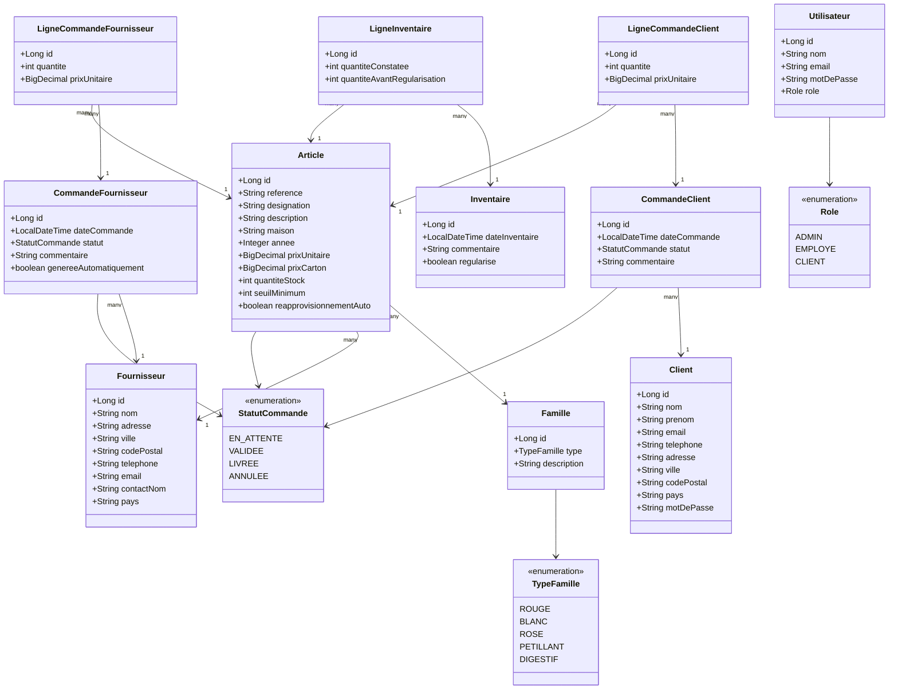

# Diagramme de classes — NEGOSUD

```mermaid
classDiagram
    direction TB

    class Article {
        +Long id
        +String reference
        +String designation
        +String description
        +String maison
        +Integer annee
        +BigDecimal prixUnitaire
        +BigDecimal prixCarton
        +int quantiteStock
        +int seuilMinimum
        +boolean reapprovisionnementAuto
    }

    class Famille {
        +Long id
        +TypeFamille type
        +String description
    }

    class Fournisseur {
        +Long id
        +String nom
        +String adresse
        +String ville
        +String codePostal
        +String telephone
        +String email
        +String contactNom
        +String pays
    }

    class Client {
        +Long id
        +String nom
        +String prenom
        +String email
        +String telephone
        +String adresse
        +String ville
        +String codePostal
        +String pays
        +String motDePasse
    }

    class Utilisateur {
        +Long id
        +String nom
        +String email
        +String motDePasse
        +Role role
    }

    class CommandeClient {
        +Long id
        +LocalDateTime dateCommande
        +StatutCommande statut
        +String commentaire
    }

    class CommandeFournisseur {
        +Long id
        +LocalDateTime dateCommande
        +StatutCommande statut
        +String commentaire
        +boolean genereeAutomatiquement
    }

    class LigneCommandeClient {
        +Long id
        +int quantite
        +BigDecimal prixUnitaire
    }

    class LigneCommandeFournisseur {
        +Long id
        +int quantite
        +BigDecimal prixUnitaire
    }

    class Inventaire {
        +Long id
        +LocalDateTime dateInventaire
        +String commentaire
        +boolean regularise
    }

    class LigneInventaire {
        +Long id
        +int quantiteConstatee
        +int quantiteAvantRegularisation
    }

    class StatutCommande {
        <<enumeration>>
        EN_ATTENTE
        VALIDEE
        LIVREE
        ANNULEE
    }

    class TypeFamille {
        <<enumeration>>
        ROUGE
        BLANC
        ROSE
        PETILLANT
        DIGESTIF
    }

    class Role {
        <<enumeration>>
        ADMIN
        EMPLOYE
        CLIENT
    }

    Article "many" --> "1" Famille
    Article "many" --> "1" Fournisseur

    CommandeClient "many" --> "1" Client
    LigneCommandeClient "many" --> "1" CommandeClient
    LigneCommandeClient "many" --> "1" Article

    CommandeFournisseur "many" --> "1" Fournisseur
    LigneCommandeFournisseur "many" --> "1" CommandeFournisseur
    LigneCommandeFournisseur "many" --> "1" Article

    LigneInventaire "many" --> "1" Inventaire
    LigneInventaire "many" --> "1" Article

    Utilisateur --> Role
    Article --> StatutCommande
    CommandeClient --> StatutCommande
    CommandeFournisseur --> StatutCommande
    Famille --> TypeFamille
```
