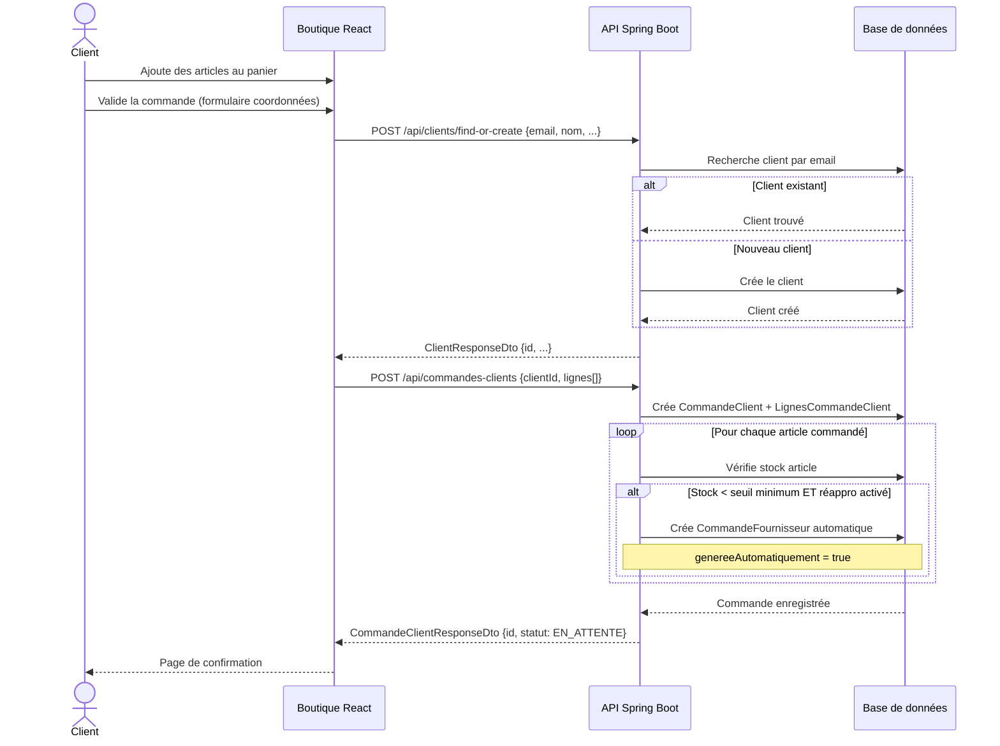
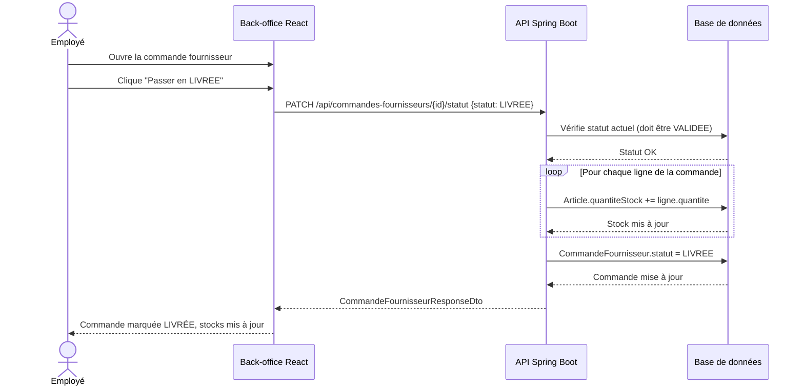
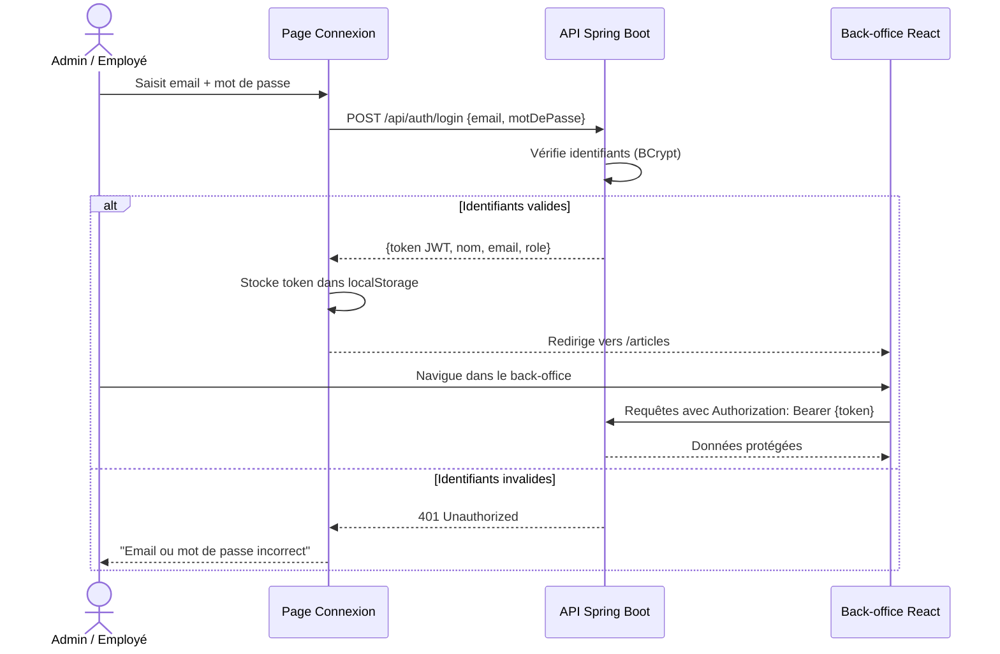
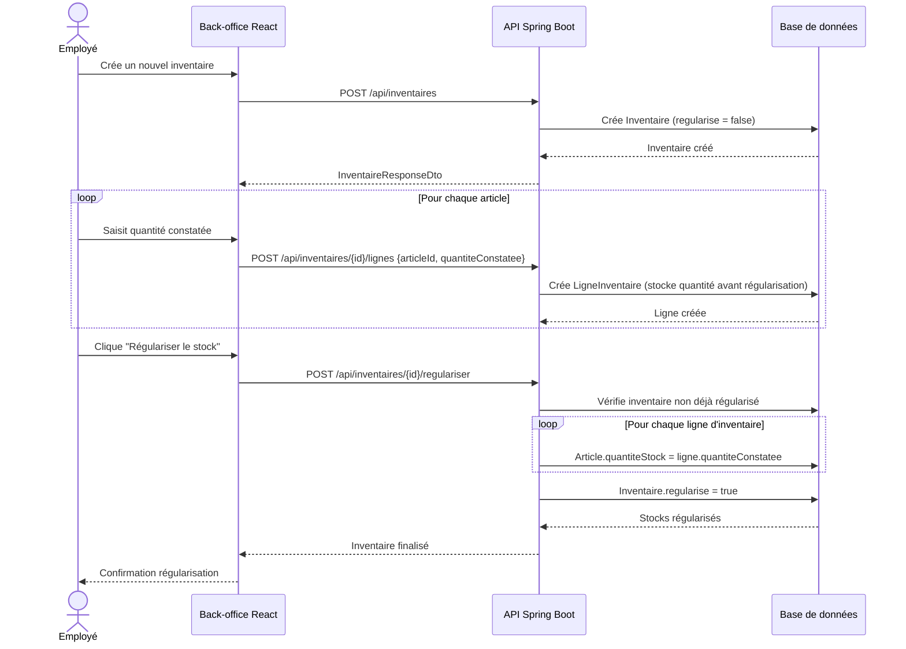

# Diagrammes de séquence — NEGOSUD

---

## 1. Passage de commande boutique (avec réapprovisionnement automatique)

---

## 2. Livraison d'une commande fournisseur (mise à jour du stock)

---

## 3. Connexion et accès back-office

---

## 4. Inventaire et régularisation du stock

